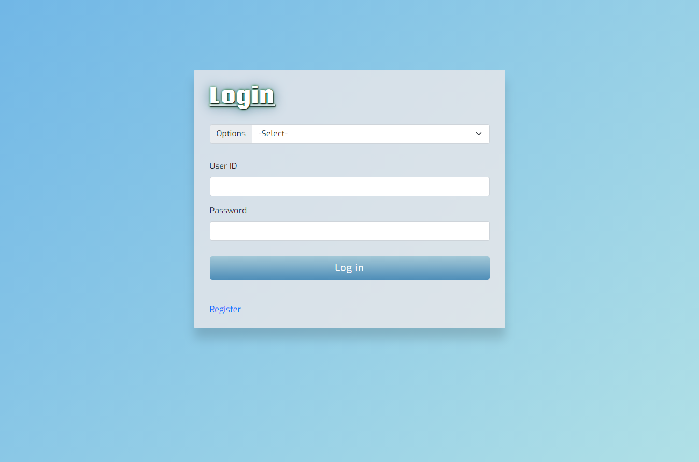
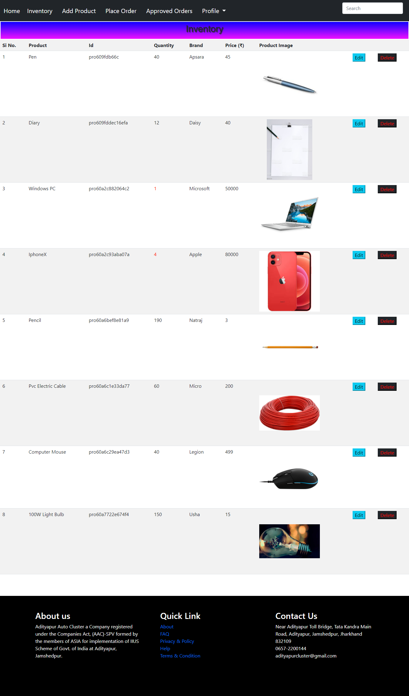
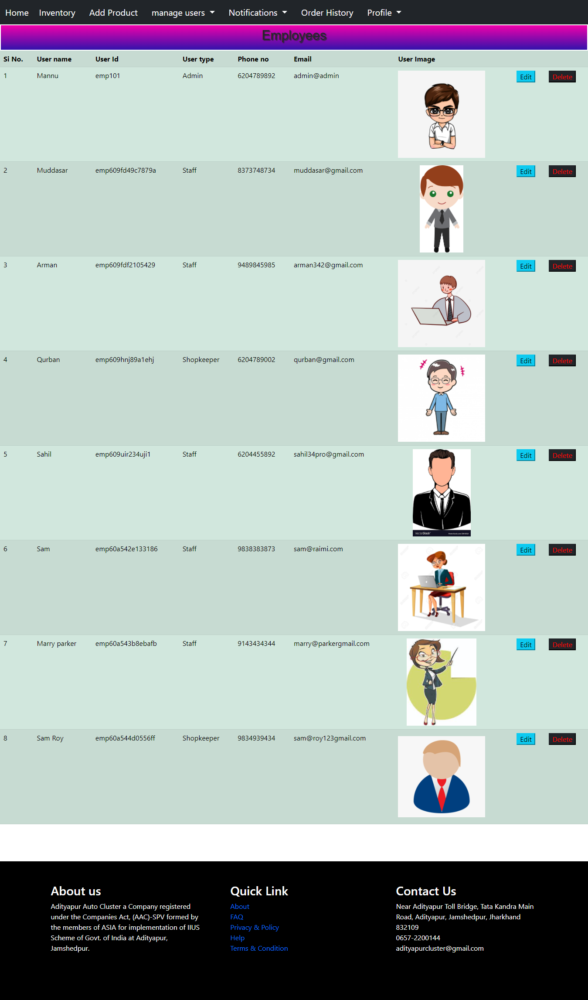
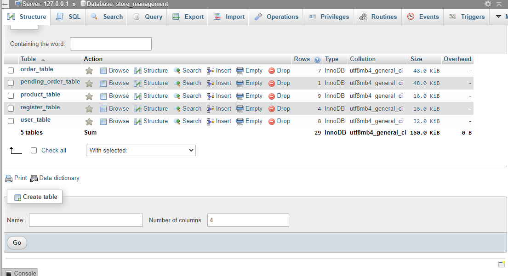

# Store-Management

This is a Web based Store Management software which is used for maintaining inventory system inside an Organization. This Website has been built in Html , css , bootstrap , javascript , php .This website can be used in any organization to manage their inventory management system of storing products .

## Features of Store Management System
* New staff can register to the website
* Admin can Add , Delete , See and Update User Details of Store Management System
* Admin and Shopkeeper can Add , Delete , See and Update Product Details
* Admin can approve new Registered Users
* Staffs can see prodct details (name , id , quantity , price)
* Shopkeeper can Place order on behalf of the Staff
* Admin can approve orders placed by Shopkeeper
* Admin , Shopkeeper can see all the order details
* Staff can see only his order history
* All the Users can See and Update their Information in Profile Page
***
## Advantages of Web Bases Store Management System
* Better Performance than the traditional Store Management System
* Less error on managing product details
* faster transactions 
* Less Time consuming
***
# Screenshots
***
## Home Page

## Login Page

## Registration Page

## Inventory Page

## Product Page

## Place Order Page

## User Information Page

## Add Product Page

## Add User Page

## Order History Page

## Notifications for Registered Page

## Profile Page

## Mysql Page

***
# Release History

* 1.0.0 The First proper release
* 1.0.1 changes in  front end of product page
